<p align="center">
  
  
  
</p>

<p align="center">
  <a href="https://worksofabhiram.live"></a>
  <a href="https://www.linkedin.com/in/abhiram-kace"></a>
  <a href="mailto:write4abhiram@gmail.com"></a>
</p>


Most of my work happens forward deployed: on the call with the client, then in the codebase
writing what we just agreed to. I sit with it until it actually ships, and the part I like more
is what comes after, when something built for one client turns out to be worth putting back into
the product. I only bring in new tech once I have actually researched it.


### `~/ work`

```
scope      19 enterprise engagements across 6 countries, each one
           owned from scoping and architecture through TypeScript
           implementation, launch, and CS handoff
stack      Botpress ADK in TypeScript, no low code studio, wired
           into whatever the client already runs: HubSpot,
           Twilio, Shopify, WhatsApp, Gmail
product    when one client needs something the market probably
           needs too, it goes back into the product. The
           ecommerce vertical and the delivery harness both
           started as single engagements
internal   work the team kept redoing became Claude skills and
           agentic harnesses that scaffold, test, and validate a
           whole bot end to end
context    joined as the second person on delivery, reporting to
           the Director of Delivery with no lead layer in
           between. That team is now eight
```


### `~/ shipped`

Selected from 19, all production deployed and tested end to end.

```
HEAG                 FSA Handbook knowledge base with citation validation
PetSmart             enterprise support agent
Yamaha Motor Mexico  lead qualification on WhatsApp and webchat
iolo Technologies    retention agent with live CRM lookup
London and Partners  live booking against the LTD and Ventrata APIs
IonOptix             email drafts under strict RAG
Back to the Roots    plant diagnosis plus Shopify product search
UpsideDrinks.ca      bilingual FR and EN Shopify assistant
Estrelar             autonomous support with JWT, MFA, and refund APIs
Monjur               legal document knowledge automation
```


### `~/ setup`

```
Neovim       LazyVim base, hand maintained. Clients, tickets, PRs,
             diffs, and deploys all live in one session
Ghostty      GPU accelerated terminal, sharing one palette with the
             editor so themes never drift
Claude Code  30+ custom delivery skills for ADK building, live bot
             testing, webchat validation
Codex        wired in as an MCP server, bidirectional bridge so
             both agents share the same tools
Pi harness   dispatches Opus, Sonnet, and Haiku side by side
gh.lua       2.6k lines of Lua: GitHub and Linear from inside the
             buffer
```


### `~/ before`

```
Deloitte USI    Associate Analyst. For Aflac, automation that
                categorized and routed insurance claims flagged for
                revision, plus Selenium suites so regression passes
                ran unattended
Digital Uplift  co founded with recent Island grads. Automated
                workflows that turned out small, clean Next.js sites
                for boutique businesses with no web presence.
                Lighthouse 100 on SEO, accessibility, and best
                practices
ObjectStore     contract build of objectstore.ca from architecture to
                production, no agency in between
Langroove       React Native and Firebase language practice app with
                live translation
```


### `~/ school`

```
2023    Post Graduate Diploma, Digital Design and Development,
        mobile app stream. North Island College, BC
2017    Bachelor of Engineering, Computer Science. Bangalore
        City University
```


<p align="center">
  
  
  
  
  
  
  
  
  
  
</p>
