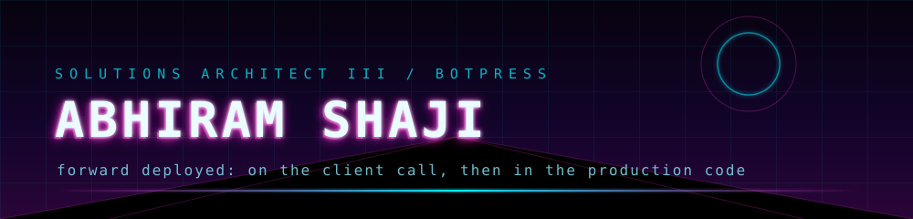

<p align="center">
  
  
  
</p>

<p align="center">
  <a href="https://worksofabhiram.live"></a>
  <a href="https://www.linkedin.com/in/abhiram-kace"></a>
  <a href="mailto:write4abhiram@gmail.com"></a>
</p>


Most of my work happens forward deployed: on the call with the client, then in the codebase
writing what we just agreed to. I sit with it until it actually ships, and the part I like more
is what comes after, when something built for one client turns out to be worth putting back into
the product. I only bring in new tech once I have actually researched it.


### `~/ setup`

```
Neovim       LazyVim base, hand maintained. Clients, tickets, PRs,
             diffs, and deploys all live in one session
Ghostty      GPU accelerated terminal, sharing one palette with the
             editor so themes never drift
Claude Code  30+ custom delivery skills for ADK building, live bot
             testing, webchat validation
Codex        wired in as an MCP server, bidirectional bridge so
             both agents share the same tools
Pi harness   dispatches Opus, Sonnet, and Haiku side by side
gh.lua       2.6k lines of Lua: GitHub and Linear from inside the
             buffer
```


